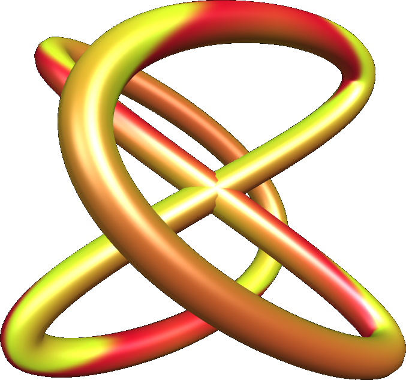

# QQQLANG: A syntax-free programming language for image synthesis

**https://qqqlang.com**

In QQQLANG, any string of visible uppercase ASCII characters is a valid program.

Each character has three properties:
- An integer ('A'=1, 'B'=2, [...], '}'=67, '~'=68)
- A color
- A function

Functions can take zero or more arguments. If a function takes arguments, the characters that follow are interpreted as arguments. Otherwise characters are interpreted as functions. The exception is the first character of the program string which sets an initial solid color.

For example, the program `ABCD` has the following interpretation:

- `A` sets the initial color to #78A10F
- `B` is the 'border' function that creates a circular gradient around the edges. It takes one argument, the border color.
- `C` becomes the argument to 'B', the color of 'C' is #FF6B35
- `D` is the 'drip' function, which creates a water drop effect. It takes no arguments.

If the program string ends before the last function has had arguments defined, it will use its own number and color as default arguments. For example, the programs `AL`, `ALL`, and `ALLL` are equivalent.

The question mark character `?` is also a function that displays help text. `?1` and `??` show the first page of help, and `?A`, `?B`, etc. show subsequent pages of help text.

Some functions take an image index as an argument, and uses that old image in some way. `?#` shows the history of images and the characters to use to retrieve each image.

---

# About

QQQLANG is built by me, Andreas Jansson, and is MIT licensed. The code is on github.com/andreasjansson/qqqlang.

QQQ is short for QQQEJOTTONO, a word that my three-year old son wrote on a label maker. He then went on to write fifty or so other words, until the label roll ran out. I thought it'd be nice if these labels could be treated like code.

So QQQLANG is really a language designed for three year olds. It's a Turing complete* stack-based language that can accept any string of characters as a valid program, because each character is either a function name or an argument, depending on context.

(* Turing complete because it includes a Rule 110 function)

There are 68 functions, some are normal image editing functions like '1' (colorize), and some are weird, like 'L' (3D Lissajous tubes) or 'V' (overlay another image in the stack in Voronoi patterns).

The output images are completely deterministic given the program string and canvas size. You can share a qqqlang.com URL to replicate and fork the image.

QQQLANG is both an image synthesis and editing language. You can upload an image as the starting image, or as arguments to functions that take image inputs. You can also paste images from the clipboard, or paste image URLs.

The language is complete and won't change (other than bug fixes). But anyone can fork the language and add new functions as a different language. It would be both fun and possible to build languages like QQQ-AUDIO, QQQ-VIDEO, QQQ-3D, etc.

---

# Character Reference

## `A` — number 1, color 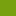

<a href="https://qqqlang.com/?p=%E2%98%80Lh8lX-CEM_8ykW3QtaeIywA">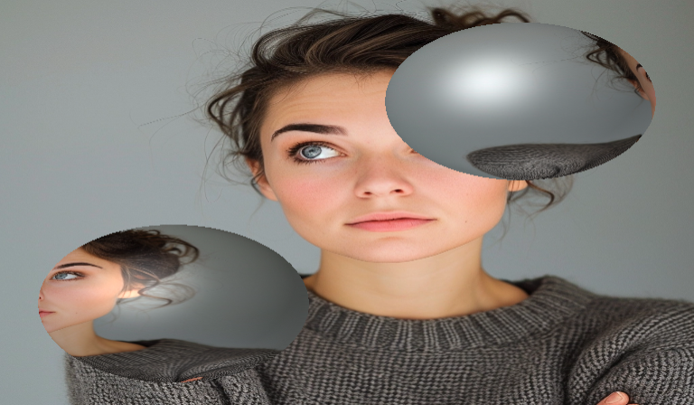</a>

**Function:** `spheres` — Renders image as texture on two 3D spheres with lighting.

 

---

## `B` — number 2, color 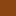

<a href="https://qqqlang.com/?p=%E2%98%80Lh8lX-CEM_8ykW3QtaeIywBAA">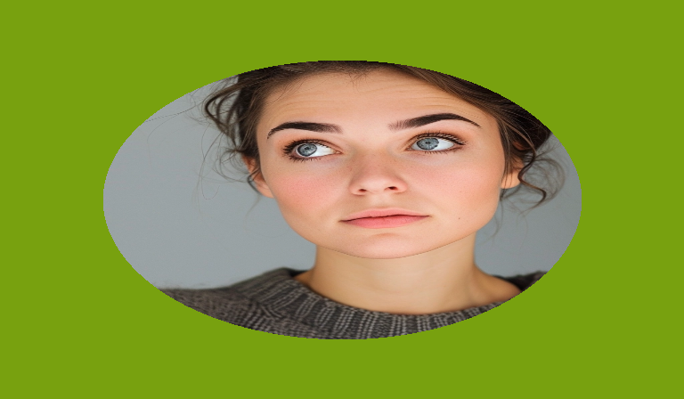</a>

**Function:** `border` — Border effect with various shapes.

**Arguments:**
   1. Border shape style (A=circular-solid, B=circular-blur, C=horizontal-solid, D=horizontal-blur, E=vertical-solid, F=vertical-blur, G=rectangular-solid, H=rectangular-blur, ...)
   2. Border color

 

---

## `C` — number 3, color 

<a href="https://qqqlang.com/?p=%E2%98%80Lh8lX-CEM_8ykW3QtaeIywCP">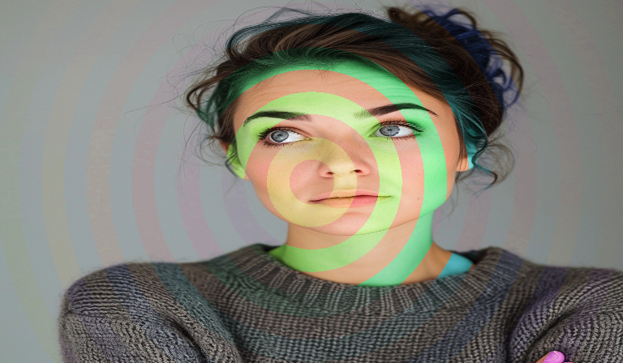</a>

**Function:** `concentric-hue` — Alternating original and hue-shifted concentric circles.

**Arguments:**
   1. Number of concentric circles

 

---

## `D` — number 4, color 

<a href="https://qqqlang.com/?p=%E2%98%80Lh8lX-CEM_8ykW3QtaeIywD">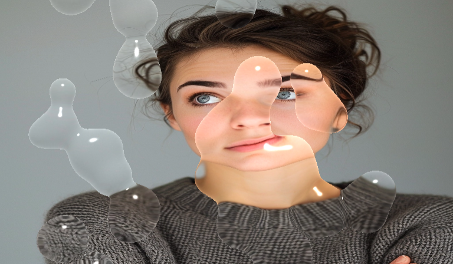</a>

**Function:** `drip` — Metaball-based dripping water drops effect.

 

---

## `E` — number 5, color 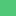

<a href="https://qqqlang.com/?p=%E2%98%80Lh8lX-CEM_8ykW3QtaeIywE">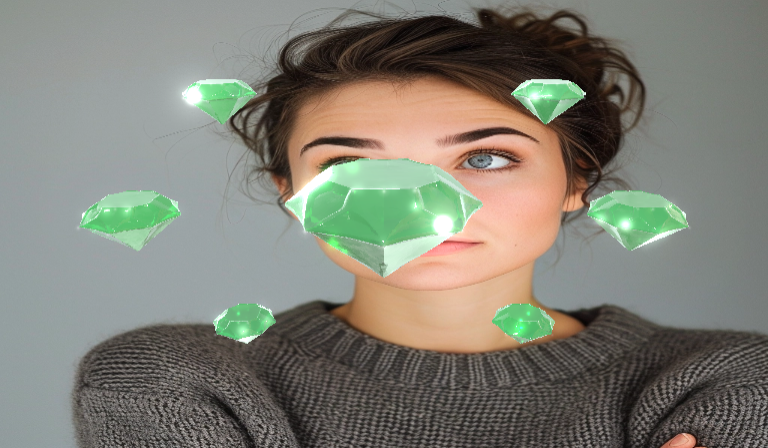</a>

**Function:** `emerald` — Renders reflective 3D emeralds in symmetric pattern.

 

---

## `F` — number 6, color 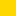

<a href="https://qqqlang.com/?p=%E2%98%80Lh8lX-CEM_8ykW3QtaeIywFB">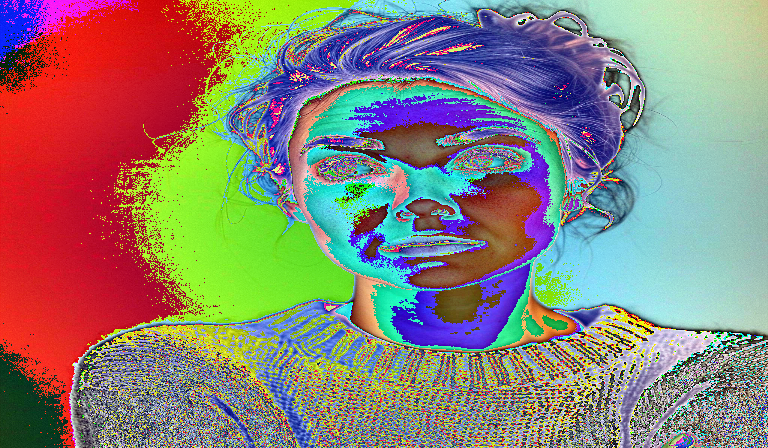</a>

**Function:** `fft-overflow` — 2D FFT with magnitude overflow and chromatic phase shifts.

**Arguments:**
   1. FFT multiplier strength

 

---

## `G` — number 7, color 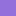

<a href="https://qqqlang.com/?p=%E2%98%80Lh8lX-CEM_8ykW3QtaeIywGG">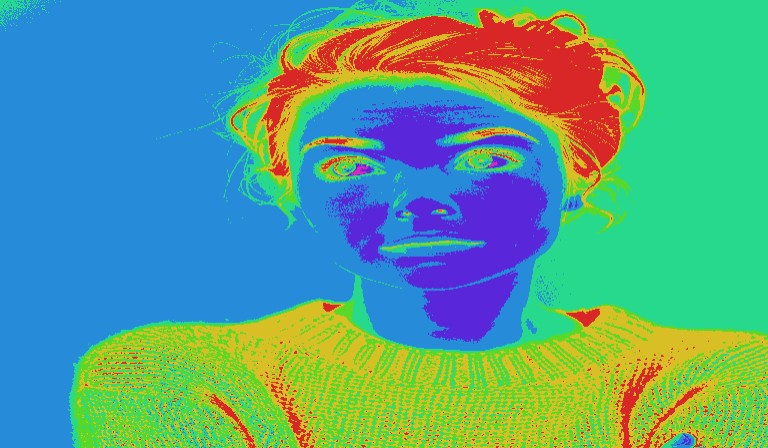</a>

**Function:** `grayscale-colorize` — Converts to grayscale then applies rainbow palette.

**Arguments:**
   1. Number of posterize colors

 

---

## `H` — number 8, color 

<a href="https://qqqlang.com/?p=%E2%98%80Lh8lX-CEM_8ykW3QtaeIywH">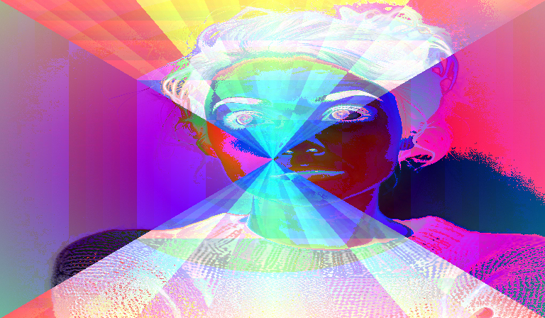</a>

**Function:** `hourglass` — Hourglass gradient with bitwise color blending.

 

---

## `I` — number 9, color 

<a href="https://qqqlang.com/?p=%E2%98%80Lh8lX-CEM_8ykW3QtaeIywI">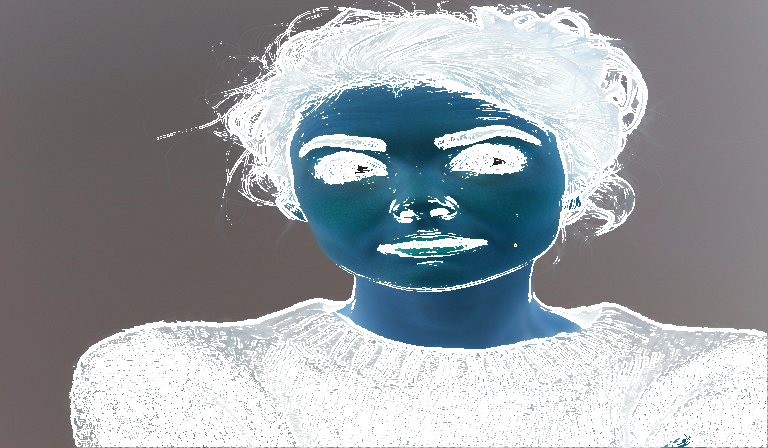</a>

**Function:** `invert-edges` — Inverts colors then adds Sobel edge detection.

 

---

## `J` — number 10, color 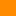

<a href="https://qqqlang.com/?p=%E2%98%80Lh8lX-CEM_8ykW3QtaeIywJM">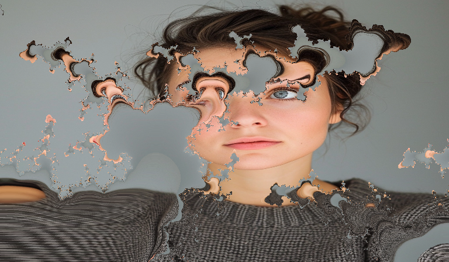</a>

**Function:** `julia-fractal` — Julia set fractal masking the previous image.

**Arguments:**
   1. Fractal zoom depth

 

---

## `K` — number 11, color 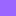

<a href="https://qqqlang.com/?p=%E2%98%80Lh8lX-CEM_8ykW3QtaeIywKE">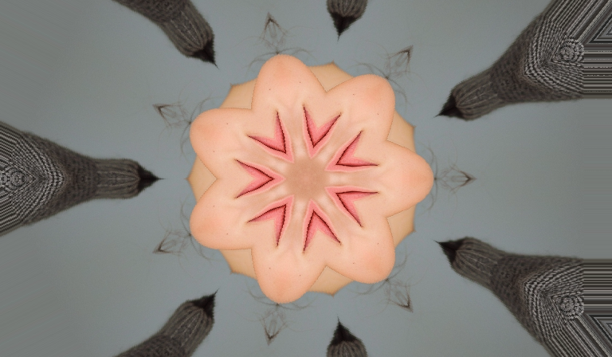</a>

**Function:** `kaleidoscope` — N-way kaleidoscope effect with zoom.

**Arguments:**
   1. Number of kaleidoscope segments

 

---

## `L` — number 12, color 

<a href="https://qqqlang.com/?p=%E2%98%80Lh8lX-CEM_8ykW3QtaeIywLLL">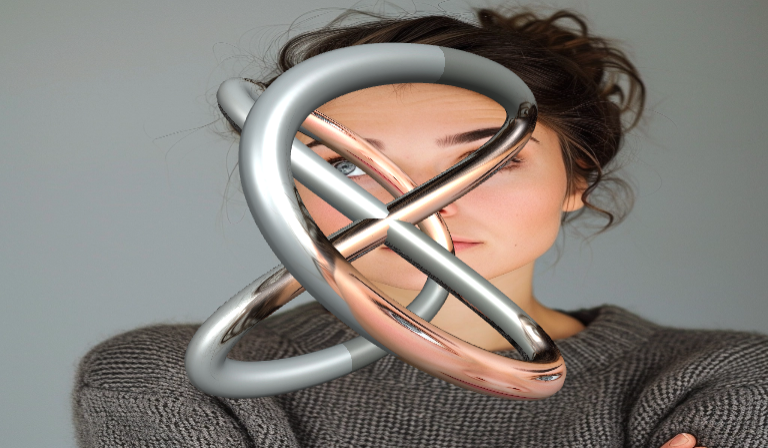</a>

**Function:** `lissajous` — 3D Lissajous tube with textured surface.

**Arguments:**
   1. Old image for tube texture
   2. Rotation angle multiplier

 

---

## `M` — number 13, color 

<a href="https://qqqlang.com/?p=%E2%98%80Lh8lX-CEM_8ykW3QtaeIywMC">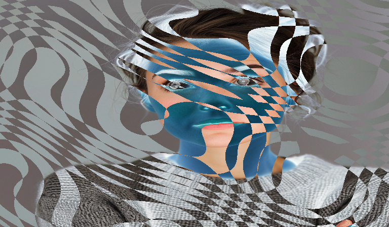</a>

**Function:** `moire` — Moiré interference pattern with color zones.

**Arguments:**
   1. Pattern complexity seed

 

---

## `N` — number 14, color 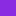

<a href="https://qqqlang.com/?p=%E2%98%80Lh8lX-CEM_8ykW3QtaeIywN">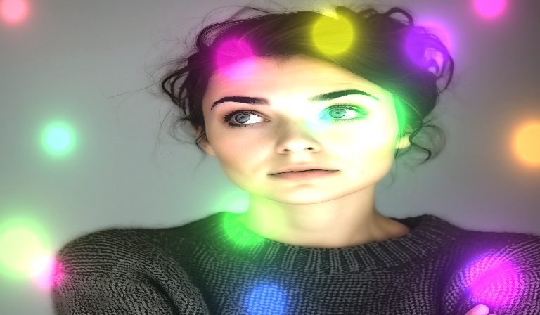</a>

**Function:** `neon` — Neon glow effect on bright edges.

 

---

## `O` — number 15, color 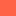

<a href="https://qqqlang.com/?p=%E2%98%80Lh8lX-CEM_8ykW3QtaeIywO9">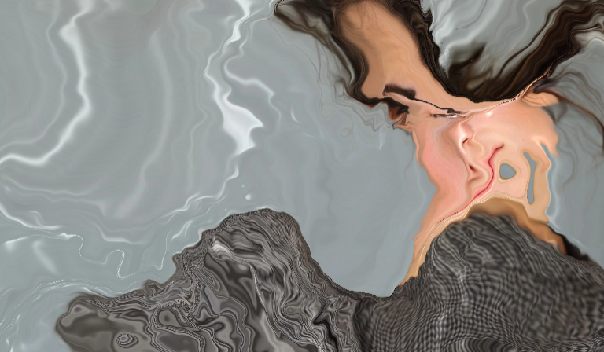</a>

**Function:** `oil-slick` — Domain warping with iridescent lighting.

**Arguments:**
   1. Warp intensity and depth

 

---

## `P` — number 16, color 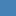

<a href="https://qqqlang.com/?p=%E2%98%80Lh8lX-CEM_8ykW3QtaeIywP6">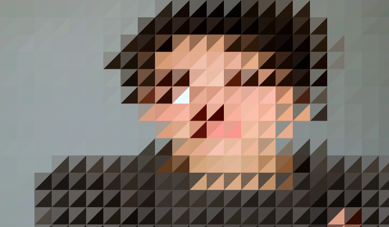</a>

**Function:** `pixelate` — Pixelate with diagonal split using average/saturated colors.

**Arguments:**
   1. Pixel cell size

 

---

## `Q` — number 17, color 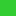

<a href="https://qqqlang.com/?p=%E2%98%80Lh8lX-CEM_8ykW3QtaeIywQ">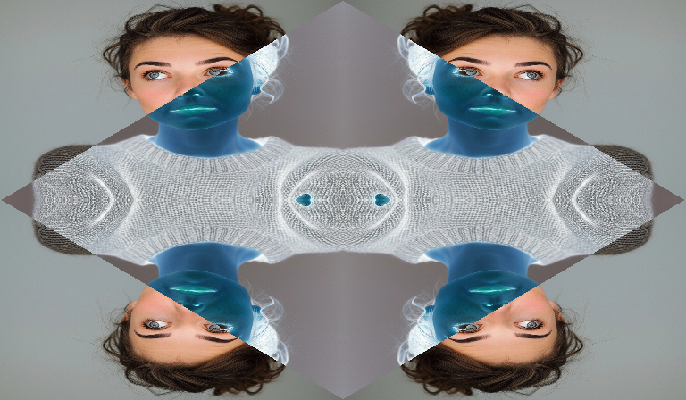</a>

**Function:** `quad-prism` — Negative prism with diagonal inversion and mirroring.

 

---

## `R` — number 18, color 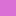

<a href="https://qqqlang.com/?p=%E2%98%80Lh8lX-CEM_8ykW3QtaeIywR">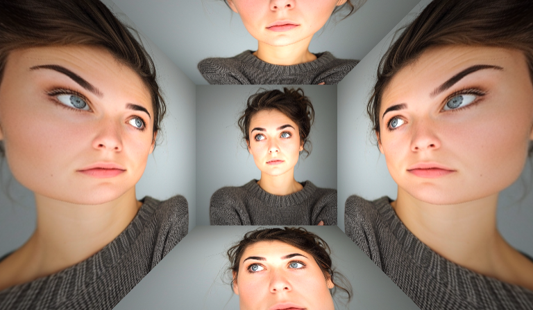</a>

**Function:** `room` — 3D room with textured walls, ceiling, and floor.

 

---

## `S` — number 19, color 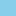

<a href="https://qqqlang.com/?p=%E2%98%80Lh8lX-CEM_8ykW3QtaeIywSSS">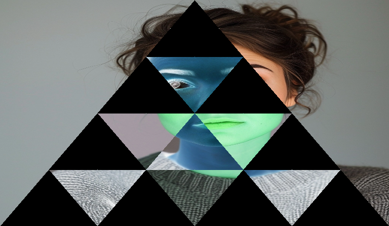</a>

**Function:** `sierpinski` — Sierpiński triangle fractal with color effects.

**Arguments:**
   1. Old image for triangle interior
   2. Fractal detail level (A-~)

 

---

## `T` — number 20, color 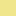

<a href="https://qqqlang.com/?p=%E2%98%80Lh8lX-CEM_8ykW3QtaeIywT8">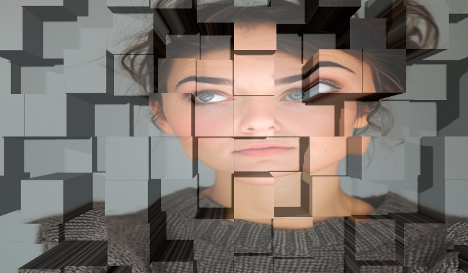</a>

**Function:** `tiles` — Grid of 3D tiles covering entire canvas, heights based on seed with multiplier.

**Arguments:**
   1. Building height multiplier (A=short, ~=tall)

 

---

## `U` — number 21, color 

<a href="https://qqqlang.com/?p=%E2%98%80Lh8lX-CEM_8ykW3QtaeIywUB">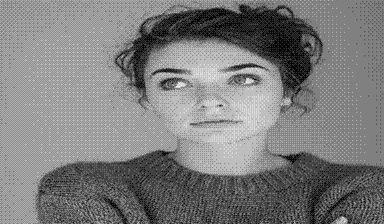</a>

**Function:** `dither` — Apply one of 16 dithering algorithms, from subtle to aggressive 2-color modes.

**Arguments:**
   1. Dithering algorithm (A=ordered-5level, B=bayer-bw, C=threshold-bw, D=ordered-2bit, E=floyd-rgb, F=floyd-bw, G=atkinson-4level, H=atkinson-bw, ...)

 

---

## `V` — number 22, color 

<a href="https://qqqlang.com/?p=%E2%98%80Lh8lX-CEM_8ykW3QtaeIyw)~1AVBJ">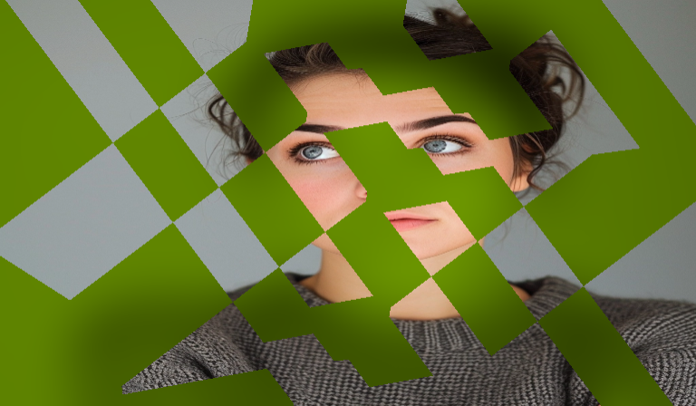</a>

**Function:** `voronoi` — Voronoi cells alternating between current and old image, with variable pattern shape.

**Arguments:**
   1. Old image to alternate with
   2. Pattern shape

 

---

## `W` — number 23, color 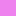

<a href="https://qqqlang.com/?p=%E2%98%80Lh8lX-CEM_8ykW3QtaeIywWW">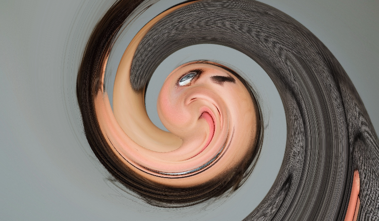</a>

**Function:** `whirl` — Swirl distortion from center with quadratic falloff.

**Arguments:**
   1. Rotation multiplier (×20°)

 

---

## `X` — number 24, color 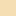

<a href="https://qqqlang.com/?p=%E2%98%80Lh8lX-CEM_8ykW3QtaeIywX~">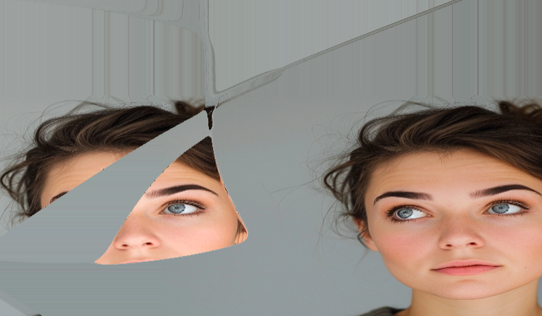</a>

**Function:** `cppn` — Compositional Pattern Producing Network warps and modulates saturation/value using a neural network. Fully deterministic based on input.

**Arguments:**
   1. Effect strength

 

---

## `Y` — number 25, color 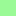

<a href="https://qqqlang.com/?p=%E2%98%80Lh8lX-CEM_8ykW3QtaeIywYY">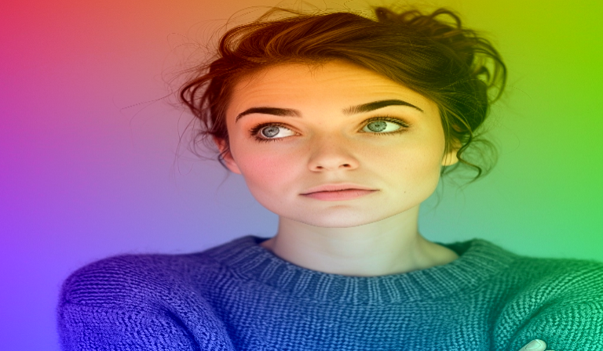</a>

**Function:** `yuv-shift` — YUV color shift with three gradient directions 120° apart: luminance, blue chrominance, and red chrominance shifts.

**Arguments:**
   1. Controls angle and intensity of color shifts

 

---

## `Z` — number 26, color 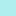

<a href="https://qqqlang.com/?p=%E2%98%80Lh8lX-CEM_8ykW3QtaeIywZK">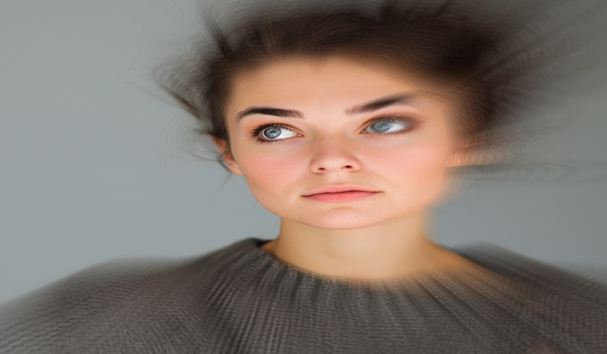</a>

**Function:** `zoom-blur` — Radial motion blur from center with sharp center.

**Arguments:**
   1. Blur strength multiplier (×4px)

 

---

## `0` — number 27, color 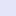

<a href="https://qqqlang.com/?p=%E2%98%80Lh8lX-CEM_8ykW3QtaeIyw0A">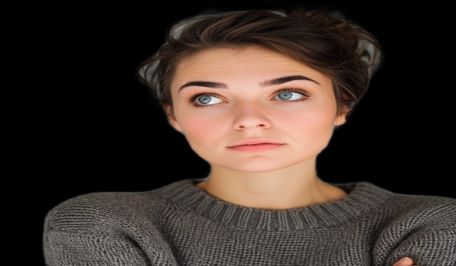</a>

**Function:** `bg-remove` — Removes background from prev image using ML, composites on specified background.

**Arguments:**
   1. Background image to composite behind

 

---

## `1` — number 28, color 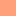

<a href="https://qqqlang.com/?p=%E2%98%80Lh8lX-CEM_8ykW3QtaeIyw1E">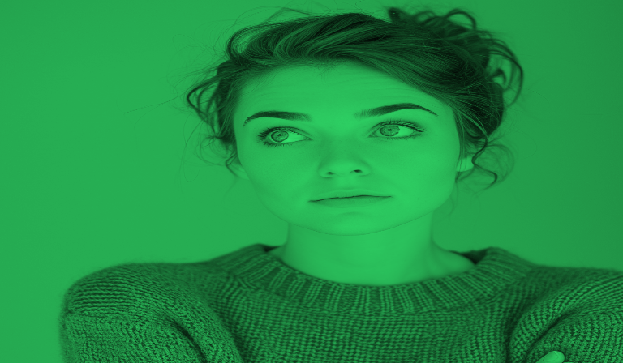</a>

**Function:** `colorize` — Tints the image with the specified color using gamma-corrected luminance and boosted saturation.

**Arguments:**
   1. Tint color applied based on luminance

 

---

## `2` — number 29, color 

<a href="https://qqqlang.com/?p=%E2%98%80Lh8lX-CEM_8ykW3QtaeIyw2BAB">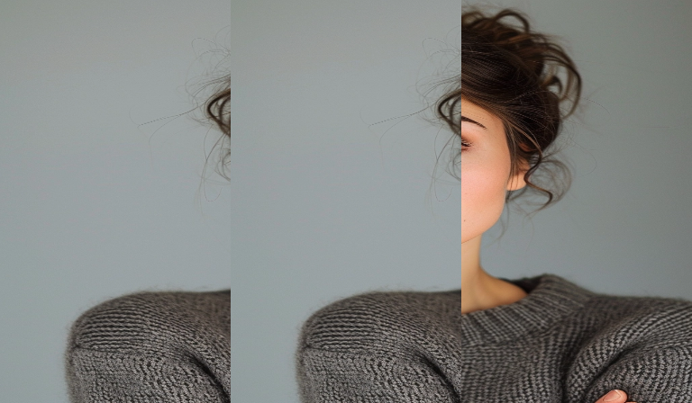</a>

**Function:** `third-stamp` — Replace a vertical third of current image with a third from old image.

**Arguments:**
   1. Old image to extract third from
   2. Old image third (1=left, 2=mid, 3=right, cycling)
   3. Current image third to replace (1=left, 2=mid, 3=right, cycling)

 

---

## `3` — number 30, color 

**Function:** `triple-rotate` — Three vertical strips with different rotations.

 

---

## `4` — number 31, color 

**Function:** `quad-rotate` — Four quadrants each rotated 0°, 90°, 180°, 270°.

 

---

## `5` — number 32, color 

**Function:** `triangular-split` — Triangular grid with hue shifts and lightness variation.

**Arguments:**
   1. Cell size multiplier

 

---

## `6` — number 33, color 

**Function:** `posterize` — Posterize to 4 levels per channel.

 

---

## `7` — number 34, color 

**Function:** `chromatic` — Chromatic aberration with RGB channel shifts.

 

---

## `8` — number 35, color 

**Function:** `lemniscate` — Infinity-loop lemniscate distortion.

**Arguments:**
   1. Distortion strength

 

---

## `9` — number 36, color 

**Function:** `xor-blend` — XOR blend creating glitchy digital artifacts.

**Arguments:**
   1. Old image to XOR with

 

---

## `<` — number 37, color 

**Function:** `horizontal-shift` — Horizontal shift with wraparound.

**Arguments:**
   1. Shift amount (A=left, 7=none, ~=right)

 

---

## `>` — number 38, color 

**Function:** `rotate-90` — Rotate 90 degrees clockwise.

 

---

## `^` — number 39, color 

**Function:** `vertical-shift` — Vertical shift with wraparound.

**Arguments:**
   1. Shift amount (A=up, 7=none, ~=down)

 

---

## `!` — number 40, color 

**Function:** `godrays` — Volumetric light scattering from center.

 

---

## `"` — number 41, color 

**Function:** `band-transform` — Horizontal bands with alternating hue/saturation transforms.

**Arguments:**
   1. Number of horizontal bands

 

---

## `#` — number 42, color 

**Function:** `insert` — Replaces current image with specified old image.

**Arguments:**
   1. Old image index to insert

 

---

## `$` — number 43, color 

**Function:** `segment-hue-sort` — Color-based segmentation, then sorts pixels by hue within each segment.

 

---

## `%` — number 44, color 

**Function:** `flip` — Flips image horizontally or vertically based on argument parity.

**Arguments:**
   1. Flip direction (even=horizontal, odd=vertical)

 

---

## `&` — number 45, color 

**Function:** `quadtree-compress` — Adaptive quadtree compression - detailed areas keep resolution while uniform areas become large blocks, creating geometric patterns.

**Arguments:**
   1. Compression level (A=minimal/detailed, ~=maximal/geometric blocks)

 

---

## `'` — number 46, color 

**Function:** `variable-checkerboard` — Checkerboard blend with increasing square size from corner to corner.

**Arguments:**
   1. Old image to checkerboard with

 

---

## `(` — number 47, color 

**Function:** `shear-radial` — Combined shear and radial distortion. Shear amount couples to horizontal offset and radial strength.

**Arguments:**
   1. Center X offset (A=left, M=center, ~=right)
   2. Center Y offset (A=bottom, M=center, ~=top)
   3. Radial/shear strength (A=barrel, M=none, ~=pincushion)

 

---

## `)` — number 48, color 

**Function:** `blur` — Gaussian blur with adjustable radius using two-pass convolution.

**Arguments:**
   1. Blur radius (A=subtle, ~=heavy)

 

---

## `*` — number 49, color 

**Function:** `fur` — Fur/hair strands growing from pixels based on hue and noise.

 

---

## `+` — number 50, color 

**Function:** `zoom` — Zoom in 1.2× from center.

 

---

## `,` — number 51, color 

**Function:** `stipple` — Stipple dots at luminance-based positions.

**Arguments:**
   1. Stipple dot color

 

---

## `-` — number 52, color 

**Function:** `blend` — Blend old image with current using specified mode.

**Arguments:**
   1. Old image to blend with
   2. Blend mode (A=multiply, B=screen, C=overlay, D=darken, E=lighten, F=dodge, G=burn, H=hardlight, ...)

 

---

## `.` — number 53, color 

**Function:** `pointillism` — Pointillism effect with saturated circular dots.

**Arguments:**
   1. Dot radius base (mod 8 + 2)

 

---

## `/` — number 54, color 

**Function:** `circle-stamp` — Stamp circular region from old image center onto current.

**Arguments:**
   1. Old image source
   2. X position (A=left, 7=center, ~=right)
   3. Y position (A=top, 7=center, ~=bottom)
   4. Circle size (A=tiny, ~=full)
   5. Blend mode (A=normal, B=xor, C=nand, D=and, E=or, F=multiply, G=screen, H=overlay, ...)

 

---

## `:` — number 55, color 

**Function:** `porthole` — Circular window showing current image with old image as background.

**Arguments:**
   1. Old image for background

 

---

## `;` — number 56, color 

**Function:** `semicircle-reflect` — Top semicircle preserved, bottom reflected with wave distortion.

 

---

## `=` — number 57, color 

**Function:** `shifted-stripes` — Horizontal stripes with alternating shifts.

**Arguments:**
   1. Stripe height in pixels

 

---

## `?` — number 58, color 

**Function:** `help` — Display help text or image history table.

**Arguments:**
   1. Page number (A=intro, B+=reference, #=history)

 

---

## `@` — number 59, color 

**Function:** `cond` — Per-pixel conditional: extracts channel from condition image, outputs true-image pixel where value >= threshold, otherwise false-image pixel.

**Arguments:**
   1. Condition image sampled for threshold comparison
   2. Source image when condition >= threshold
   3. Source image when condition < threshold
   4. Color channel to extract from condition image (A=hue, B=saturation, C=lightness, D=red, E=green, F=blue)
   5. Threshold (A=0%, ~=100% of channel range)

 

---

## `[` — number 60, color 

**Function:** `rotate` — Rotate around center.

**Arguments:**
   1. Rotation amount (A=left, 7=none, ~=right)

 

---

## `\\` — number 61, color 

**Function:** `composite` — Composite transformed region from old image onto current.

**Arguments:**
   1. Old image source
   2. Source X (normalized 0-1)
   3. Source Y (normalized 0-1)
   4. Source width (normalized 0-1)
   5. Source height (normalized 0-1)
   6. Dest X (normalized 0-1)
   7. Dest Y (normalized 0-1)
   8. Dest width (normalized 0-1)
   9. Dest height (normalized 0-1)
   10. Rotation (normalized 0-1 → 0-360°)
   11. Blend mode (mod 16: normal, xor, nand, and, or, multiply, screen, overlay, darken, lighten, diff, excl, add, sub, hard, soft)

 

---

## `]` — number 62, color 

**Function:** `left-half-offset` — Shift left half vertically by 20% with wraparound.

 

---

## `_` — number 63, color 

**Function:** `scanlines` — CRT scanline effect with darkening and displacement.

 

---

## `\`` — number 64, color 

**Function:** `rule110` — Rule 110 cellular automaton - a Turing-complete 1D CA applied horizontally to each row.

**Arguments:**
   1. Number of generations (×8)

 

---

## `{` — number 65, color 

**Function:** `skew` — Skew horizontal with wraparound.

**Arguments:**
   1. Skew amount (A=left, 7=none, ~=right)

 

---

## `|` — number 66, color 

**Function:** `vertical-split` — Vertical split with wavy blend zone using multiple blend modes.

**Arguments:**
   1. Old image for right half

 

---

## `}` — number 67, color 

**Function:** `sharpen` — Sharpen using convolution kernel to enhance edges.

 

---

## `~` — number 68, color 

**Function:** `wave-chromatic` — Horizontal wave distortion with chromatic aberration.

**Arguments:**
   1. Wave amplitude and chromatic shift

 

---

## License

MIT

## Author

Andreas Jansson ([@andreasjansson](https://github.com/andreasjansson))
