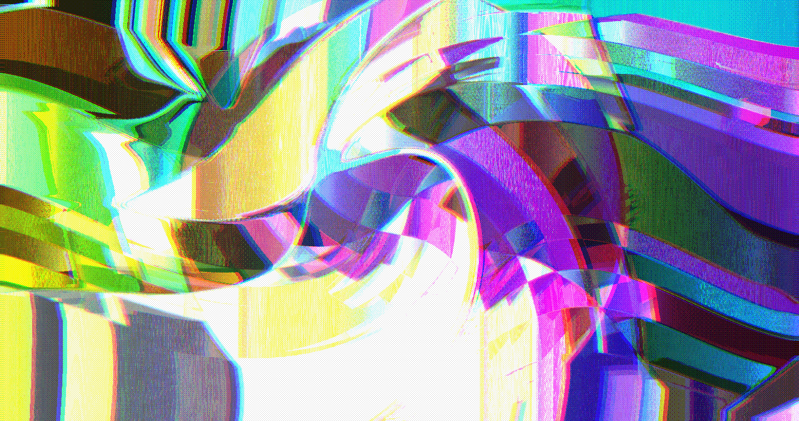
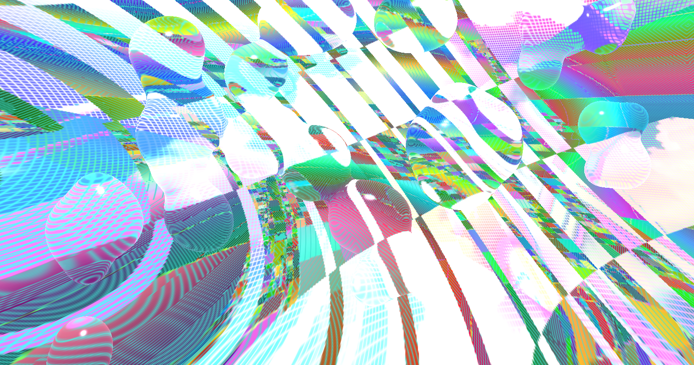
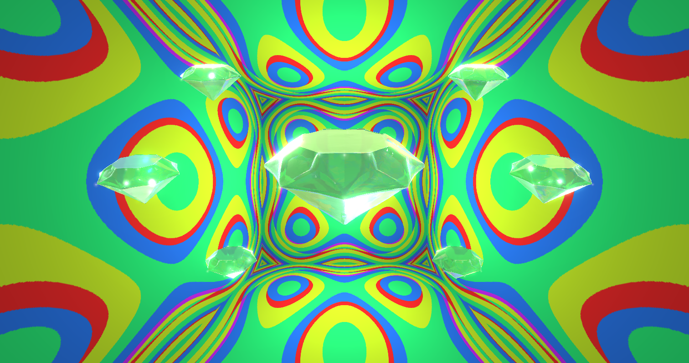
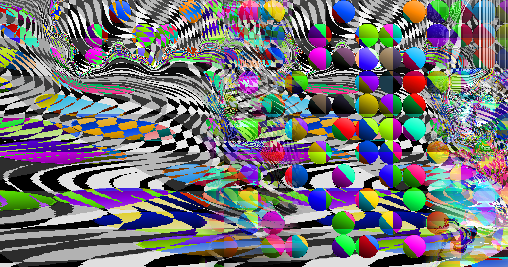
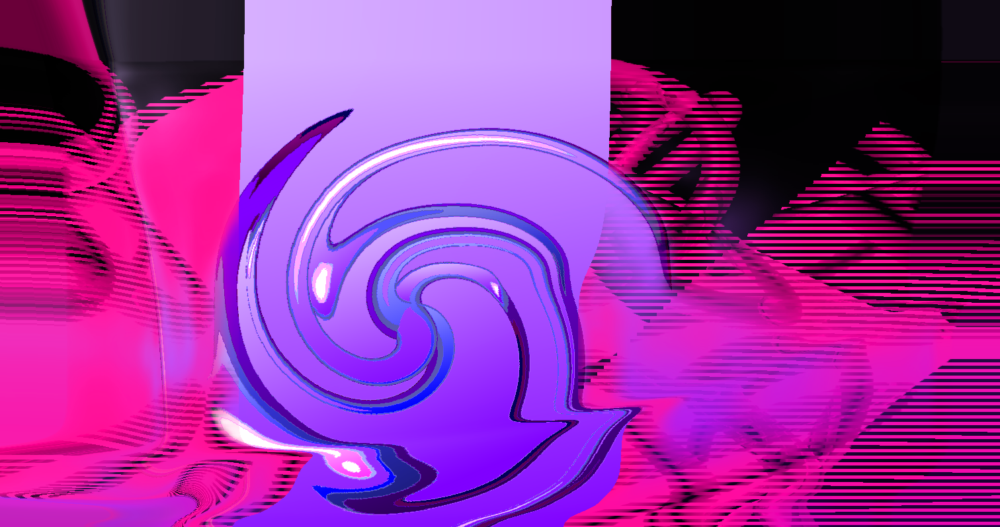
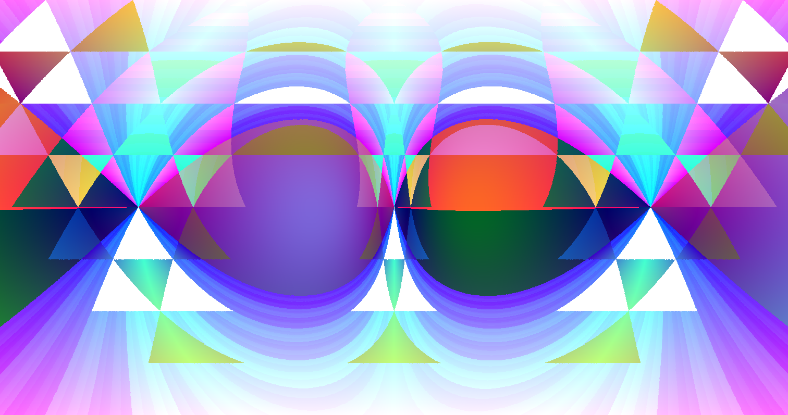
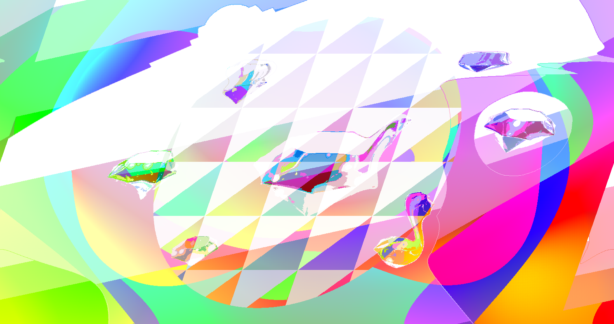
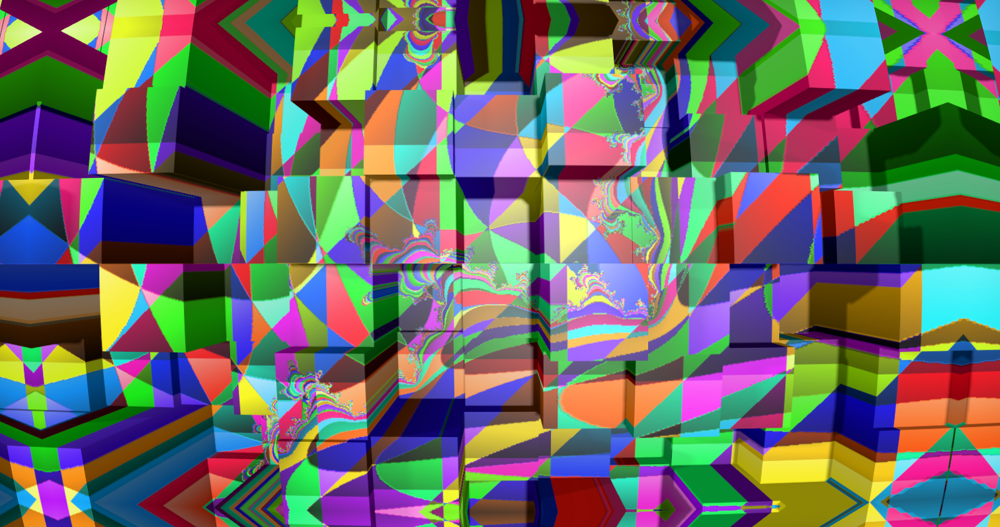
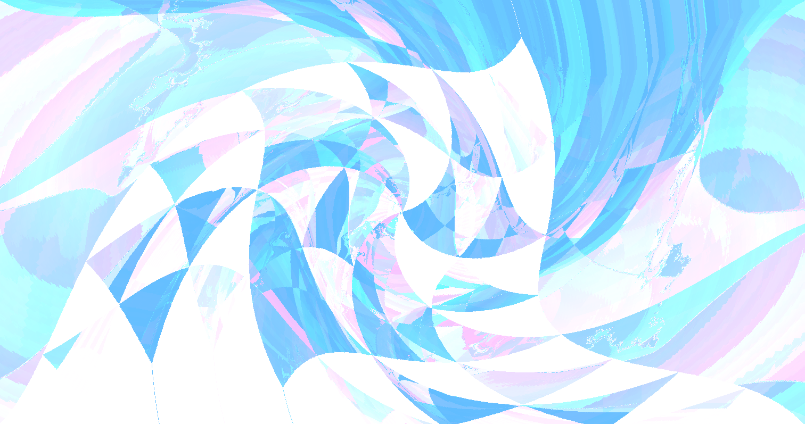

# QQQLANG: A syntax-free programming language for image synthesis

**https://qqqlang.com**

In QQQLANG, any string of visible uppercase ASCII characters is a valid program.

Each character has three properties:
- An integer (`A`=1, `B`=2, [...], `}`=67, `~`=68)
- A color
- A function

Functions can take zero or more arguments. If a function takes arguments, the characters that follow are interpreted as arguments. Otherwise characters are interpreted as functions. The exception is the first character of the program string which sets an initial solid color.

For example, the program `ABCD` has the following interpretation:

- `A` sets the initial color to #78A10F
- `B` is the 'border' function that creates a circular gradient around the edges. It takes one argument, the border color.
- `C` becomes the argument to 'B', the color of 'C' is #FF6B35
- `D` is the 'drip' function, which creates a water drop effect. It takes no arguments.

If the program string ends before the last function has had arguments defined, it will use its own number and color as default arguments. For example, the programs `AL`, `ALL`, and `ALLL` are equivalent.

The question mark character `?` is also a function that displays help text. `?1` and `??` show the first page of help, and `?A`, `?B`, etc. show subsequent pages of help text.

Some functions take an image index as an argument, and uses that old image in some way. `?#` shows the history of images and the characters to use to retrieve each image.

# Gallery

<table>
<tr>
<td></td>
<td></td>
<td></td>
</tr>
<tr>
<td></td>
<td></td>
<td></td>
</tr>
<tr>
<td></td>
<td></td>
<td></td>
</tr>
</table>

# About

QQQ is short for QQQEJOTTONO, a word that my three-year old son wrote on a label maker. He then went on to write fifty or so other words, until the label roll ran out. I thought it'd be nice if these labels could be treated like code.

So QQQLANG is really a language designed for three year olds. It's a Turing complete* stack-based language that can accept any string of characters as a valid program, because each character is either a function name or an argument, depending on context.

(* Turing complete because it includes a Rule 110 function)

There are 68 functions, some are normal image editing functions like '1' (colorize), and some are weird, like `L` (3D Lissajous tubes) or `V` (overlay another image in the stack in Voronoi patterns).

The output images are completely deterministic given the program string and canvas size. You can share a qqqlang.com URL to replicate and fork the image.

QQQLANG is both an image synthesis and editing language. You can upload an image as the starting image, or as arguments to functions that take image inputs. You can also paste images from the clipboard, or paste image URLs.

This project is now finished and the language won't change (other than bug fixes). But anyone can fork the language and add new functions as a different language. It would be both fun and possible to build languages like QQQ-AUDIO, QQQ-VIDEO, QQQ-3D, etc.

# Character reference

## `A`

**Number:** 1 · **Color:**  #78A10F

**Function:** `spheres` — Renders image as texture on two 3D spheres with lighting.

 

## `B`

**Number:** 2 · **Color:**  #8B4513

**Function:** `border` — Border effect with various shapes.

**Arguments:**
   1. Border shape style (A=circular-solid, B=circular-blur, C=horizontal-solid, D=horizontal-blur, E=vertical-solid, F=vertical-blur, G=rectangular-solid, H=rectangular-blur, I=diamond-solid, J=diamond-blur, K=hexagon-solid, L=hexagon-blur, M=sine-horizontal-solid, N=sine-horizontal-blur, O=sine-vertical-solid, P=sine-vertical-blur, Q=triangle-horizontal-solid, R=triangle-horizontal-blur, S=triangle-vertical-solid, T=triangle-vertical-blur)
   2. Border color

 

## `C`

**Number:** 3 · **Color:**  #FF6B35

**Function:** `concentric-hue` — Alternating original and hue-shifted concentric circles.

**Arguments:**
   1. Number of concentric circles

 

## `D`

**Number:** 4 · **Color:**  #FF1493

**Function:** `drip` — Metaball-based dripping water drops effect.

 

## `E`

**Number:** 5 · **Color:**  #50C878

**Function:** `emerald` — Renders reflective 3D emeralds in symmetric pattern.

 

## `F`

**Number:** 6 · **Color:**  #FFD700

**Function:** `fft-overflow` — 2D FFT with magnitude overflow and chromatic phase shifts.

**Arguments:**
   1. FFT multiplier strength

 

## `G`

**Number:** 7 · **Color:**  #9370DB

**Function:** `grayscale-colorize` — Converts to grayscale then applies rainbow palette.

**Arguments:**
   1. Number of posterize colors

 

## `H`

**Number:** 8 · **Color:**  #DC143C

**Function:** `hourglass` — Hourglass gradient with bitwise color blending.

 

## `I`

**Number:** 9 · **Color:**  #00FF7F

**Function:** `invert-edges` — Inverts colors then adds Sobel edge detection.

 

## `J`

**Number:** 10 · **Color:**  #FF8C00

**Function:** `julia-fractal` — Julia set fractal masking the previous image.

**Arguments:**
   1. Fractal zoom depth

 

## `K`

**Number:** 11 · **Color:**  #9966FF

**Function:** `kaleidoscope` — N-way kaleidoscope effect with zoom.

**Arguments:**
   1. Number of kaleidoscope segments

 

## `L`

**Number:** 12 · **Color:**  #20B2AA

**Function:** `lissajous` — 3D Lissajous tube with textured surface.

**Arguments:**
   1. Old image for tube texture
   2. Rotation angle multiplier

 

## `M`

**Number:** 13 · **Color:**  #FF69B4

**Function:** `moire` — Moiré interference pattern with color zones.

**Arguments:**
   1. Pattern complexity seed

 

## `N`

**Number:** 14 · **Color:**  #8A2BE2

**Function:** `neon` — Neon glow effect on bright edges.

 

## `O`

**Number:** 15 · **Color:**  #FF6347

**Function:** `oil-slick` — Domain warping with iridescent lighting.

**Arguments:**
   1. Warp intensity and depth

 

## `P`

**Number:** 16 · **Color:**  #4682B4

**Function:** `pixelate` — Pixelate with diagonal split using average/saturated colors.

**Arguments:**
   1. Pixel cell size

 

## `Q`

**Number:** 17 · **Color:**  #32CD32

**Function:** `quad-prism` — Negative prism with diagonal inversion and mirroring.

 

## `R`

**Number:** 18 · **Color:**  #DA70D6

**Function:** `room` — 3D room with textured walls, ceiling, and floor.

 

## `S`

**Number:** 19 · **Color:**  #87CEEB

**Function:** `sierpinski` — Sierpiński triangle fractal with color effects.

**Arguments:**
   1. Old image for triangle interior
   2. Fractal detail level (A-~)

 

## `T`

**Number:** 20 · **Color:**  #F0E68C

**Function:** `tiles` — Grid of 3D tiles covering entire canvas, heights based on seed with multiplier.

**Arguments:**
   1. Building height multiplier (A=short, ~=tall)

 

## `U`

**Number:** 21 · **Color:**  #DDA0DD

**Function:** `dither` — Apply one of 16 dithering algorithms, from subtle to aggressive 2-color modes.

**Arguments:**
   1. Dithering algorithm (A=ordered-5level, B=bayer-bw, C=threshold-bw, D=ordered-2bit, E=floyd-rgb, F=floyd-bw, G=atkinson-4level, H=atkinson-bw, I=stucki-6level, J=burkes, K=sierra, L=random-bw, M=cluster-2bit, N=bluenoise-bw, O=bayer2x2-2bit, P=noise-2bit)

 

## `V`

**Number:** 22 · **Color:**  #40E0D0

**Function:** `voronoi` — Voronoi cells alternating between current and old image, with variable pattern shape.

**Arguments:**
   1. Old image to alternate with
   2. Pattern shape

 

## `W`

**Number:** 23 · **Color:**  #EE82EE

**Function:** `whirl` — Swirl distortion from center with quadratic falloff.

**Arguments:**
   1. Rotation multiplier (×20°)

 

## `X`

**Number:** 24 · **Color:**  #F5DEB3

**Function:** `cppn` — Compositional Pattern Producing Network warps and modulates saturation/value using a neural network. Fully deterministic based on input.

**Arguments:**
   1. Effect strength

 

## `Y`

**Number:** 25 · **Color:**  #98FB98

**Function:** `yuv-shift` — YUV color shift with three gradient directions 120° apart: luminance, blue chrominance, and red chrominance shifts.

**Arguments:**
   1. Controls angle and intensity of color shifts

 

## `Z`

**Number:** 26 · **Color:**  #AFEEEE

**Function:** `zoom-blur` — Radial motion blur from center with sharp center.

**Arguments:**
   1. Blur strength multiplier (×4px)

 

## `0`

**Number:** 27 · **Color:**  #E6E6FA

**Function:** `bg-remove` — Removes background from prev image using ML, composites on specified background.

**Arguments:**
   1. Background image to composite behind

 

## `1`

**Number:** 28 · **Color:**  #FFA07A

**Function:** `colorize` — Tints the image with the specified color using gamma-corrected luminance and boosted saturation.

**Arguments:**
   1. Tint color applied based on luminance

 

## `2`

**Number:** 29 · **Color:**  #98D8C8

**Function:** `third-stamp` — Replace a vertical third of current image with a third from old image.

**Arguments:**
   1. Old image to extract third from
   2. Old image third (1=left, 2=mid, 3=right, cycling)
   3. Current image third to replace (1=left, 2=mid, 3=right, cycling)

 

## `3`

**Number:** 30 · **Color:**  #F7DC6F

**Function:** `triple-rotate` — Three vertical strips with different rotations.

 

## `4`

**Number:** 31 · **Color:**  #BB8FCE

**Function:** `quad-rotate` — Four quadrants each rotated 0°, 90°, 180°, 270°.

 

## `5`

**Number:** 32 · **Color:**  #85C1E9

**Function:** `triangular-split` — Triangular grid with hue shifts and lightness variation.

**Arguments:**
   1. Cell size multiplier

 

## `6`

**Number:** 33 · **Color:**  #F1948A

**Function:** `posterize` — Posterize to 4 levels per channel.

 

## `7`

**Number:** 34 · **Color:**  #82E0AA

**Function:** `chromatic` — Chromatic aberration with RGB channel shifts.

 

## `8`

**Number:** 35 · **Color:**  #F8C471

**Function:** `lemniscate` — Infinity-loop lemniscate distortion.

**Arguments:**
   1. Distortion strength

 

## `9`

**Number:** 36 · **Color:**  #D7BDE2

**Function:** `xor-blend` — XOR blend creating glitchy digital artifacts.

**Arguments:**
   1. Old image to XOR with

 

## `<`

**Number:** 37 · **Color:**  #E74C3C

**Function:** `horizontal-shift` — Horizontal shift with wraparound.

**Arguments:**
   1. Shift amount (A=left, 7=none, ~=right)

 

## `>`

**Number:** 38 · **Color:**  #3498DB

**Function:** `rotate-90` — Rotate 90 degrees clockwise.

 

## `^`

**Number:** 39 · **Color:**  #2ECC71

**Function:** `vertical-shift` — Vertical shift with wraparound.

**Arguments:**
   1. Shift amount (A=up, 7=none, ~=down)

 

## `!`

**Number:** 40 · **Color:**  #FF4500

**Function:** `godrays` — Volumetric light scattering from center.

 

## `"`

**Number:** 41 · **Color:**  #9932CC

**Function:** `band-transform` — Horizontal bands with alternating hue/saturation transforms.

**Arguments:**
   1. Number of horizontal bands

 

## `#`

**Number:** 42 · **Color:**  #228B22

**Function:** `insert` — Replaces current image with specified old image.

**Arguments:**
   1. Old image index to insert

 

## `$`

**Number:** 43 · **Color:**  #FFD700

**Function:** `segment-hue-sort` — Color-based segmentation, then sorts pixels by hue within each segment.

 

## `%`

**Number:** 44 · **Color:**  #8B0000

**Function:** `flip` — Flips image horizontally or vertically based on argument parity.

**Arguments:**
   1. Flip direction (even=horizontal, odd=vertical)

 

## `&`

**Number:** 45 · **Color:**  #4169E1

**Function:** `quadtree-compress` — Adaptive quadtree compression - detailed areas keep resolution while uniform areas become large blocks, creating geometric patterns.

**Arguments:**
   1. Compression level (A=minimal/detailed, ~=maximal/geometric blocks)

 

## `'`

**Number:** 46 · **Color:**  #FF1493

**Function:** `variable-checkerboard` — Checkerboard blend with increasing square size from corner to corner.

**Arguments:**
   1. Old image to checkerboard with

 

## `(`

**Number:** 47 · **Color:**  #00CED1

**Function:** `shear-radial` — Combined shear and radial distortion. Shear amount couples to horizontal offset and radial strength.

**Arguments:**
   1. Center X offset (A=left, M=center, ~=right)
   2. Center Y offset (A=bottom, M=center, ~=top)
   3. Radial/shear strength (A=barrel, M=none, ~=pincushion)

 

## `)`

**Number:** 48 · **Color:**  #FF69B4

**Function:** `blur` — Gaussian blur with adjustable radius using two-pass convolution.

**Arguments:**
   1. Blur radius (A=subtle, ~=heavy)

 

## `*`

**Number:** 49 · **Color:**  #FFD700

**Function:** `fur` — Fur/hair strands growing from pixels based on hue and noise.

 

## `+`

**Number:** 50 · **Color:**  #32CD32

**Function:** `zoom` — Zoom in 1.2× from center.

 

## `,`

**Number:** 51 · **Color:**  #BA55D3

**Function:** `stipple` — Stipple dots at luminance-based positions.

**Arguments:**
   1. Stipple dot color

 

## `-`

**Number:** 52 · **Color:**  #FF7F50

**Function:** `blend` — Blend old image with current using specified mode.

**Arguments:**
   1. Old image to blend with
   2. Blend mode (A=multiply, B=screen, C=overlay, D=darken, E=lighten, F=dodge, G=burn, H=hardlight, I=softlight, J=difference, K=exclusion, L=add, M=subtract, N=xor, O=and, P=or, Q=nand, R=nor, S=xnor, T=average, U=divide, V=grain-extract, W=grain-merge, X=vivid, Y=linear, Z=pin, 0=hardmix, 1=hue, 2=saturation, 3=color, 4=luminosity, 5=replace-dark-third, 6=replace-mid-third, 7=replace-light-third, 8=opacity-25, 9=opacity-50, <=opacity-75, >=glow, ^=negation, !=phoenix, "=reflect, #=freeze, $=heat, %=stamp, &=geometric, '=hypot, (=modulo, )=modulo-reverse, *=sin-blend, +=cos-blend, ,=bitshift-left, -=bitshift-right, .=threshold-max, /=threshold-min, :=threshold-swap, ;=posterize-blend)

 

## `.`

**Number:** 53 · **Color:**  #20B2AA

**Function:** `pointillism` — Pointillism effect with saturated circular dots.

**Arguments:**
   1. Dot radius base (mod 8 + 2)

 

## `/`

**Number:** 54 · **Color:**  #CD853F

**Function:** `circle-stamp` — Stamp circular region from old image center onto current.

**Arguments:**
   1. Old image source
   2. X position (A=left, 7=center, ~=right)
   3. Y position (A=top, 7=center, ~=bottom)
   4. Circle size (A=tiny, ~=full)
   5. Blend mode (A=normal, B=xor, C=nand, D=and, E=or, F=multiply, G=screen, H=overlay, I=darken, J=lighten, K=difference, L=exclusion, M=add, N=subtract, O=hardlight, P=softlight)

 

## `:`

**Number:** 55 · **Color:**  #6B8E23

**Function:** `porthole` — Circular window showing current image with old image as background.

**Arguments:**
   1. Old image for background

 

## `;`

**Number:** 56 · **Color:**  #DB7093

**Function:** `semicircle-reflect` — Top semicircle preserved, bottom reflected with wave distortion.

 

## `=`

**Number:** 57 · **Color:**  #5F9EA0

**Function:** `shifted-stripes` — Horizontal stripes with alternating shifts.

**Arguments:**
   1. Stripe height in pixels

 

## `?`

**Number:** 58 · **Color:**  #D2691E

**Function:** `help` — Display help text or image history table.

**Arguments:**
   1. Page number (A=intro, B+=reference, #=history)

 

## `@`

**Number:** 59 · **Color:**  #7B68EE

**Function:** `cond` — Per-pixel conditional: extracts channel from condition image, outputs true-image pixel where value >= threshold, otherwise false-image pixel.

**Arguments:**
   1. Condition image sampled for threshold comparison
   2. Source image when condition >= threshold
   3. Source image when condition < threshold
   4. Color channel to extract from condition image (A=hue, B=saturation, C=lightness, D=red, E=green, F=blue)
   5. Threshold (A=0%, ~=100% of channel range)

 

## `[`

**Number:** 60 · **Color:**  #48D1CC

**Function:** `rotate` — Rotate around center.

**Arguments:**
   1. Rotation amount (A=left, 7=none, ~=right)

 

## `\\`

**Number:** 61 · **Color:**  #C71585

**Function:** `composite` — Composite transformed region from old image onto current.

**Arguments:**
   1. Old image source
   2. Source X (normalized 0-1)
   3. Source Y (normalized 0-1)
   4. Source width (normalized 0-1)
   5. Source height (normalized 0-1)
   6. Dest X (normalized 0-1)
   7. Dest Y (normalized 0-1)
   8. Dest width (normalized 0-1)
   9. Dest height (normalized 0-1)
   10. Rotation (normalized 0-1 → 0-360°)
   11. Blend mode (mod 16: normal, xor, nand, and, or, multiply, screen, overlay, darken, lighten, diff, excl, add, sub, hard, soft)

 

## `]`

**Number:** 62 · **Color:**  #00FA9A

**Function:** `left-half-offset` — Shift left half vertically by 20% with wraparound.

 

## `_`

**Number:** 63 · **Color:**  #708090

**Function:** `scanlines` — CRT scanline effect with darkening and displacement.

 

## `\``

**Number:** 64 · **Color:**  #6495ED

**Function:** `rule110` — Rule 110 cellular automaton - a Turing-complete 1D CA applied horizontally to each row.

**Arguments:**
   1. Number of generations (×8)

 

## `{`

**Number:** 65 · **Color:**  #DC143C

**Function:** `skew` — Skew horizontal with wraparound.

**Arguments:**
   1. Skew amount (A=left, 7=none, ~=right)

 

## `|`

**Number:** 66 · **Color:**  #00BFFF

**Function:** `vertical-split` — Vertical split with wavy blend zone using multiple blend modes.

**Arguments:**
   1. Old image for right half

 

## `}`

**Number:** 67 · **Color:**  #9400D3

**Function:** `gradientify` — Turns flat single-color areas into subtle gradients with hue shifts.

 

## `~`

**Number:** 68 · **Color:**  #FF6347

**Function:** `wave-chromatic` — Horizontal wave distortion with chromatic aberration.

**Arguments:**
   1. Wave amplitude and chromatic shift

 

## License

MIT

## Author

Andreas Jansson ([@andreasjansson](https://github.com/andreasjansson))
